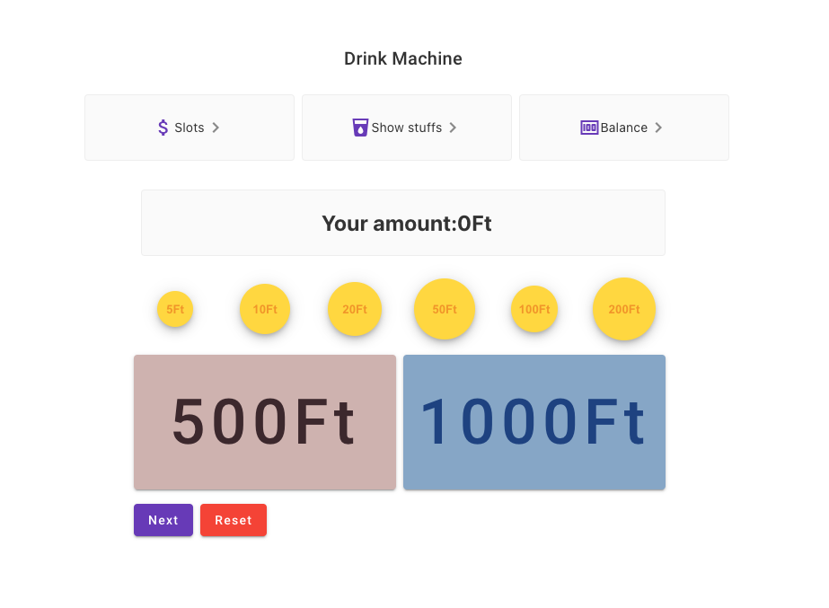
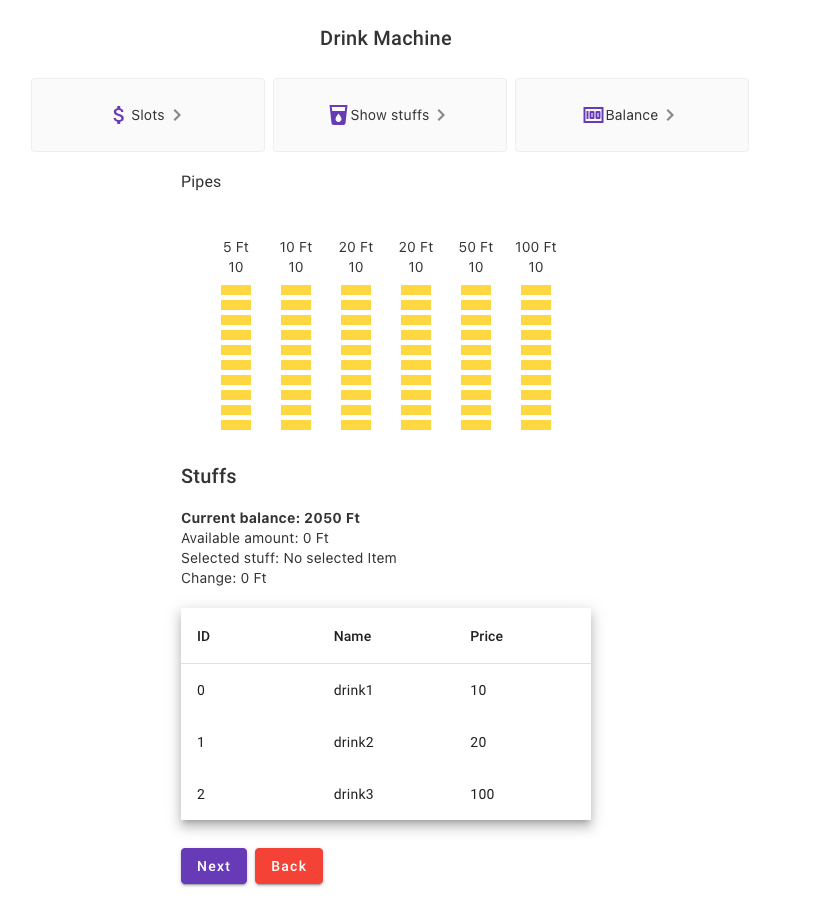

# DrinkVendingMachine

It just a little game or an example to an interview.
## The specification:

There is a drink vending machine that can sell 10 types of products

• Product1 10 HUF
• Product 2 HUF 20
• …
• Product 10 HUF 100

It includes a coin scanner, which also handles the return, and a banknote acceptance unit, which only accepts HUF 500 and 1,000 denominations, it cannot return banknotes.

The coin tester consists of 2 parts

• from a coin container, which is a unit into which, if the coin falls, the examiner can no longer return it.
• and a container for each type of coin (hereinafter referred to as a tube), of which there are 6 (5, 10, 20, 20, 50, 100) HUF coins
• each tube can store 10 coins, if the tube is full, the coins fall into the coin container
• the coin tester can only return the coins in the tubes
• a minimum of 3 coins must remain in each tube, the machine cannot return these 3 coins
• the HUF 200 coin falls into the coin holder, so you cannot return it
• when the program starts, all pipes are completely filled

The task is to write a program (Angular) that can be used to simulate purchases, the following things can be managed through the program's interface

• The customer throws in the coins or banknotes
• Selects the product
• You get the right return
• After each purchase, you must show how many coins are in the respective containers

This project was generated with [Angular CLI](https://github.com/angular/angular-cli) version 15.0.5.

## Development server

Run `ng serve` for a dev server. Navigate to `http://localhost:4200/`. The application will automatically reload if you change any of the source files.

## Code scaffolding

Run `ng generate component component-name` to generate a new component. You can also use `ng generate directive|pipe|service|class|guard|interface|enum|module`.

## Build

Run `ng build` to build the project. The build artifacts will be stored in the `dist/` directory.

## Interface

